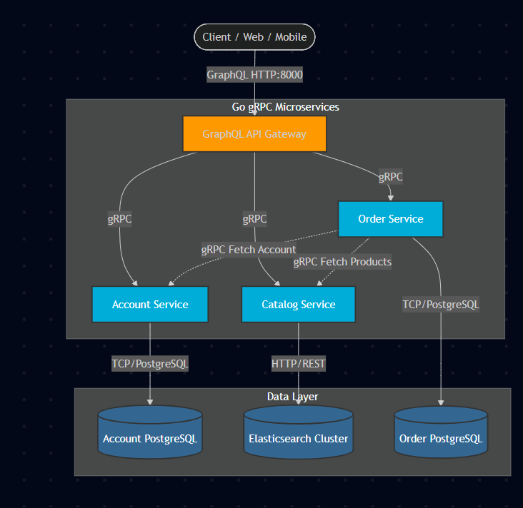

# Nexus

Nexus is a production-ready microservices backend built in **Go (Golang)**. It demonstrates a modern event-driven architecture using **gRPC** for internal communication and **GraphQL** as the API Gateway. 

## 🏗️ Architecture & Data Flow



Nexus models an e-commerce platform divided into three independent microservices that own their own databases:

1. **Account Service (PostgreSQL):** Manages user data.
2. **Catalog Service (Elasticsearch):** Manages products and powerful full-text search.
3. **Order Service (PostgreSQL + RabbitMQ):** Manages purchases. When a user buys something, it validates the user via gRPC, processes the order, and asynchronously publishes an event to RabbitMQ.

**The Gateway:** Clients never talk to the databases directly. They communicate exclusively with the **GraphQL Gateway**, which stitches the data together by firing off high-speed gRPC requests to the internal services.

## 🚀 Tech Stack

- **Language:** Go 1.20
- **API Gateway:** GraphQL (`gqlgen`)
- **Internal RPC:** gRPC & Protocol Buffers
- **Message Broker:** RabbitMQ
- **Databases:** PostgreSQL (Relational) & Elasticsearch v7.17 (Search)
- **Infrastructure:** Docker & Docker Compose (ARM & x86 Compatible)

## 🚦 Live API Testing

The API is currently live! You can test the entire microservices flow directly from your browser. 

👉 **Live GraphQL Playground:** [http://nexus-go.duckdns.org:8000/playground](http://nexus-go.duckdns.org:8000/playground)

### 1. Create an Account
Run this mutation to create a new user. *(Save the `id` it returns!)*
```graphql
mutation {
  createAccount(account: { name: "Alice" }) {
    id
    name
  }
}
```

### 2. Create a Product
Run this to add an item to the Elasticsearch catalog. *(Save the `id` it returns!)*
```graphql
mutation {
  createProduct(
    product: {
      name: "Mechanical Keyboard"
      description: "Hot-swappable 75%"
      price: 129.99
    }
  ) {
    id
    name
    price
  }
}
```

### 3. Place an Order (Triggers RabbitMQ)
Replace the IDs below with the ones you got from Steps 1 and 2, then run it. *Behind the scenes, the Order service will process this and instantly fire an event to RabbitMQ!*
```graphql
mutation {
  createOrder(
    order: {
      accountId: "<PASTE_ACCOUNT_ID_HERE>"
      products: [
        { id: "<PASTE_PRODUCT_ID_HERE>", quantity: 2 }
      ]
    }
  ) {
    id
    totalPrice
  }
}
```

### 4. Query Everything (gRPC Data Stitching)
Run this massive query to fetch the Account, their Orders, and the specific Products inside the order all at once. The GraphQL gateway resolves this by making high-speed gRPC calls to all three microservices simultaneously.
```graphql
query {
  accounts {
    name
    orders {
      id
      totalPrice
      createdAt
      products {
        name
        price
        quantity
      }
    }
  }
}
```

## 📊 Performance & Load Testing

The architecture was load-tested using **k6** to simulate 50 concurrent virtual users continuously hitting the GraphQL API. The backend successfully stitched data via gRPC across multiple databases (Elasticsearch, PostgreSQL, RabbitMQ) under heavy load.

**Test Results (50 Concurrent Users over 50 seconds):**
- **Total Requests:** 932
- **HTTP Success Rate:** 100% (Zero server crashes)
- **GraphQL Success Rate:** 96%
- **Median Latency:** 187ms

*Given that this test was run against a tiny single-core cloud instance (1 OCPU / 1GB RAM) running 6 massive containers concurrently, a 187ms median response time with 100% HTTP uptime demonstrates the extreme lightweight performance and resilience of this Go + gRPC architecture.*

## 💻 Local Development

You only need **Docker** installed. No local Go environment is required.

1. **Spin up the cluster:**
   ```bash
   docker compose up -d --build
   ```
2. **Access the Dashboards:**
   - **GraphQL API:** [http://localhost:8000/playground](http://localhost:8000/playground)
   - **RabbitMQ Dashboard:** [http://localhost:15672](http://localhost:15672) *(Login: `guest` / `guest`)*

## 🧹 Clean Up

To gracefully stop the containers and wipe the local databases:
```bash
docker compose down -v
```
