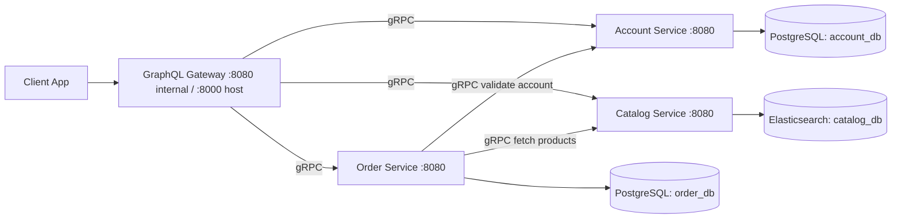

# Go gRPC + GraphQL Microservices

A production-style microservices reference project in Go that demonstrates how to combine:

- gRPC for internal service-to-service contracts
- GraphQL as a single client-facing API gateway
- Polyglot persistence (PostgreSQL + Elasticsearch)
- Containerized local development with Docker Compose

This repository models a small commerce domain with three bounded services:

- Account Service
- Catalog Service
- Order Service

All of them are exposed to clients through a GraphQL server.

## What This Project Is About

This project is an implementation of a microservices architecture where each domain owns its data and behavior:

- Accounts are stored in PostgreSQL.
- Products are indexed in Elasticsearch.
- Orders are stored in PostgreSQL and enriched with product/account data through gRPC calls.

Instead of exposing multiple APIs to frontend clients, the system provides one GraphQL endpoint that composes data from all services.

## Why This Architecture

This repository demonstrates common real-world architectural goals:

- Clear service boundaries by domain.
- Strong service contracts with protobuf + gRPC.
- Unified client API with GraphQL.
- Independent persistence choice per service.
- Better local reproducibility through Dockerized infrastructure.

It is especially useful as a learning project for engineers moving from monoliths to service-oriented systems.

## How It Works

### High-Level Flow

1. Client sends a GraphQL query or mutation.
2. GraphQL server resolves fields by calling internal gRPC clients.
3. Domain services execute business logic and persistence operations.
4. GraphQL gateway composes responses into a single shape for the client.

### Architecture Diagram



## Services

### Account Service

- Transport: gRPC
- Storage: PostgreSQL
- Main capabilities:
  - Create account
  - Get account by ID
  - List accounts with pagination

### Catalog Service

- Transport: gRPC
- Storage: Elasticsearch
- Main capabilities:
  - Create product
  - Get product by ID
  - List products
  - Full-text search by name/description
  - Batch fetch by IDs

### Order Service

- Transport: gRPC
- Storage: PostgreSQL
- Main capabilities:
  - Create order
  - Fetch orders for an account
- Cross-service behavior:
  - Validates account existence through Account Service
  - Resolves product details from Catalog Service
  - Persists order snapshot + product quantities

### GraphQL Gateway

- Transport: HTTP
- Endpoints:
  - `/graphql`
  - `/playground`
- Role:
  - Maps GraphQL schema resolvers to internal gRPC calls
  - Composes Account, Product, and Order graphs

## Tech Stack

- Go 1.13
- gRPC + Protocol Buffers
- gqlgen (GraphQL server)
- PostgreSQL (accounts, orders)
- Elasticsearch 6.x (catalog)
- Docker + Docker Compose

## Repository Layout

```text
account/   Account domain service + proto + PostgreSQL setup
catalog/   Catalog domain service + proto + Elasticsearch repository
order/     Order domain service + proto + PostgreSQL setup
graphql/   GraphQL schema, resolvers, and gateway app
```

## Prerequisites

- Docker
- Docker Compose

No local Go toolchain is required for the standard Compose flow.

## Quick Start (Recommended)

1. Build and start all services:

```bash
docker compose up --build
```

2. Open GraphQL Playground:

```text
http://localhost:8000/playground
```

3. GraphQL endpoint:

```text
http://localhost:8000/graphql
```

## GraphQL Usage Examples

### 1) Create an account

```graphql
mutation {
  createAccount(account: { name: "Alice" }) {
    id
    name
  }
}
```

### 2) Create products

```graphql
mutation {
  p1: createProduct(
    product: {
      name: "Mechanical Keyboard"
      description: "Hot-swappable 75%"
      price: 129.99
    }
  ) {
    id
    name
    price
  }
  p2: createProduct(
    product: {
      name: "Wireless Mouse"
      description: "Ergonomic with USB-C"
      price: 59.50
    }
  ) {
    id
    name
    price
  }
}
```

### 3) Query products

```graphql
query {
  products(query: "wireless") {
    id
    name
    description
    price
  }
}
```

### 4) Create an order

```graphql
mutation {
  createOrder(
    order: {
      accountId: "ACCOUNT_ID"
      products: [
        { id: "PRODUCT_ID_1", quantity: 2 }
        { id: "PRODUCT_ID_2", quantity: 1 }
      ]
    }
  ) {
    id
    createdAt
    totalPrice
  }
}
```

### 5) Query accounts with nested orders

```graphql
query {
  accounts {
    id
    name
    orders {
      id
      createdAt
      totalPrice
      products {
        id
        name
        price
        quantity
      }
    }
  }
}
```

## Environment Variables

The services are wired by Compose with these variables:

- `DATABASE_URL`
- `ACCOUNT_SERVICE_URL`
- `CATALOG_SERVICE_URL`
- `ORDER_SERVICE_URL`

## Local Development Notes

- Each service binary currently listens on port `8080` internally.
- Compose isolates services in separate containers, so fixed internal ports are safe.
- On the host, GraphQL is exposed as `8000:8080`.

## Data Schema Summary

### Account DB

`accounts(id, name)`

### Order DB

- `orders(id, created_at, account_id, total_price)`
- `order_products(order_id, product_id, quantity)`

### Catalog Index

Elasticsearch index: `catalog`

Document fields:

- `name`
- `description`
- `price`

## Regenerating Generated Code

If you modify protobuf or GraphQL schema files, regenerate code with:

```bash
go generate ./...
```

# License

This project is licensed under the MIT License
